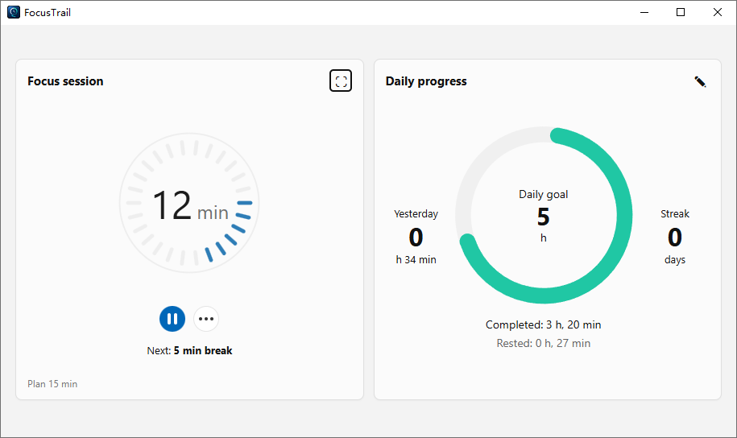
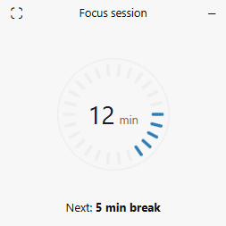

# FocusTrail

FocusTrail is a Windows desktop focus timer MVP built with Tauri 2, React, and TypeScript. Version 0.1 provides a focused-session experience inspired by the Windows Clock focus sessions: a main timer window, an always-on-top floating timer, append-only local JSONL session logs, and daily progress stats.

## Getting Started

```bash
npm install
npm run tauri:dev
```

To check the frontend build only:

```bash
npm run build
```

To build a debug desktop executable:

```bash
npm run tauri -- build --debug
```

## Data Location

FocusTrail stores data through the Tauri backend under the app data directory. On Windows, the default location is similar to:

```text
%APPDATA%\com.focustrail.desktop\data
```

The data directory is organized as:

```text
data/
  settings.json
  sessions/
    2026-05.jsonl
```

`sessions` uses append-only JSONL. Each focus or break segment is stored as one JSON line and is distinguished by `timeType` (`focus` or `rest`). Each record has a globally unique `id`; records from the same focus session share the same `sessionId`.

Only records with `status: "completed"` and `timeType: "focus"` count toward the daily goal, yesterday's completed time, and streaks. Break records are shown separately as today's rested time. Cancelled records are kept in the log but do not count toward progress. Daily progress does not delete historical logs; it uses the daily reset time in `settings.json` to determine the current reporting day.

## v0.1 Features

- Main window with focus-session and daily-progress cards.
- Focus timer states: `idle`, `running`, `paused`, `completed`, and `cancelled`.
- Configurable focus duration, optional break duration, start/pause/resume/cancel, and save-and-reset.
- Floating timer window that stays on top, keeps a square resize ratio, can pause/resume, and can return to the main window.
- Mutually exclusive main and floating windows.
- Daily progress with daily goal, yesterday's completed focus time, today's completed focus time, remaining focus time, today's rested time, and streak count from yesterday.
- Daily goal editor with hour-based goals, daily reset time, and weekend inclusion for streaks.
- Local file storage with `settings.json` and monthly JSONL session logs.
- Single-instance behavior: launching the app again focuses the existing main window.

## Not Supported Yet

FocusTrail v0.1 does not include login, Git sync, GitHub OAuth, task management, project management, cloud sync, advanced reports, calendar views, sounds, or white noise.

## Development Notes

- Local session logs are intentionally append-only.
- Git sync is reserved for a future version and is not implemented in v0.1.
- The debug executable is generated under `src-tauri/target/debug/focustrail.exe`.

## Sample

### Main Window



### Floating Timer



